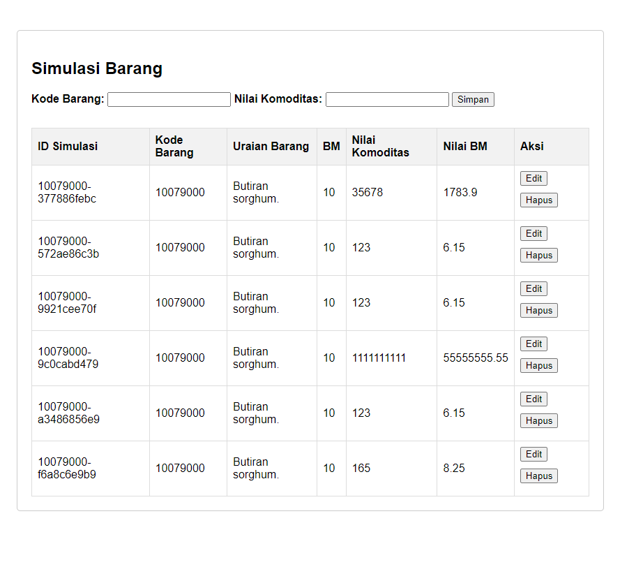

## Installation
1. Clone
2. Buat env sepreti env.copy
3. npm install
4. npx prisma migrate dev --name initial
5. node app.js
6. buka index.html di folder frontend

## Dokumentasi API
https://documenter.getpostman.com/view/15312878/2sA35HWfye

